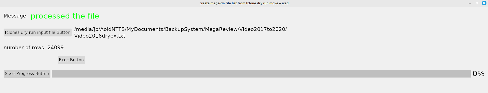

# megaremove
Rust-iced program to parse out and create mega-rm commands from fclones move --dry-run output file.

Run the following before running this app:

---- fclones group /media/jp/MyBook6TBb/MEGA/Video/Video2017to2019/Video2017 > Video2017dups.txt

---- fclones move --keep-path '\**/rawvideo/\**' --keep-path '\**short/\**' --dry-run -o Video2017dryex.txt  /media/jp/MyBook6TBb/MEGA/Video2017Target < ./Video2017dups.txt 2>Video2017dr.txt

make sure the Target file is on the same drive as Video2017

if not it will generate a cp and then rm statements, instead of mv statements.

The input file is for the app is Video2017dryex.txt and its ouput is Video2017dryex.txt__tmp3

The purpose for this was to avoid the mega sync process.

The local harddrive of the directory must match the the mega folder.

To confirm this I used megaparse.

After confirmation I run the above fclones commands and this app.

Once happy with the results, I run:

---- fclones move --keep-path '**/rawvideo/**' --keep-path '**short/**' /media/jp/MyBook6TBb/MEGA/Video2017Target < ./Video2017dups.txt 2>Video2017move.txt

---- sh Video2017dryex.txt__tmp3
